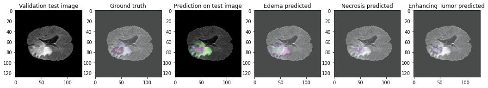
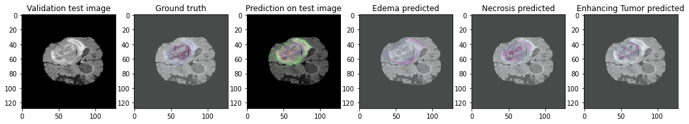

# Brats

## Dataset 

This repository details a U-Net approach to solving the BRaTS Dataset from 2020, using a combination of specific hyperparameters and binary-crossentropy for multi-class segmentation. 

The BRaTS Dataset comprises of 220 high-grade gliomas (HGG) and 54 low-grade gliomas (LGG) MRIs. The four MRI modalities are T1, T1c, T2, and T2FLAIR. Segmented “ground truth” is 3 intra-tumoral classes. edema, enhancing tumor, and necrosis.

## U-Net architecture 


U-Net is an architecture designed for biomedical image segmentation, Its output size is specifically designed so that it can be the same as the input size for minimal information loss within the data being segmented. It contains 2 paths and skip connections, one path being a contracting encoder that applies convolutional blocks followed by max-pooling to encode the input to extract the features. The decoder path is a symmetric expanding path that projects feature to gain a dense classification by using transposed convolutions.

## Framework 

For each file of the framework, it was loaded as an np array using nibabel and stored as a 4-dimensional matrix of width, height, depth, and a number of channels. Then due to the dataset being computationally expensive, the images were resized. The images were trained as a collection of 2D slices rather than a 3D array for faster computation and allowing for more specialized metrics to be evaluated.

## Predictions 






## Evaluation 
The framework evaluation results are calculated using Keras submodules and a set of custom metrics calculating the Mean Intersection over Union, the [Dice Coefficient](https://chenriang.me/f1-equal-dice-coefficient.html) of the overall prediciton, and each class. It was evaluated over 32 images in a batch size of 10:


```python
Metric Evaluation
32/32 [==============================] - 11s 241ms/step - loss: 0.2069 
- accuracy: 0.9924 - mean_io_u_1: 0.8061 - dice_coef: 0.5741 - precision: 0.9937 
- sensitivity: 0.9902 - specificity: 0.9978 - dice_necrotic: 0.4602 
- dice_edema: 0.7037 - dice_enhancing: 0.6893

```
